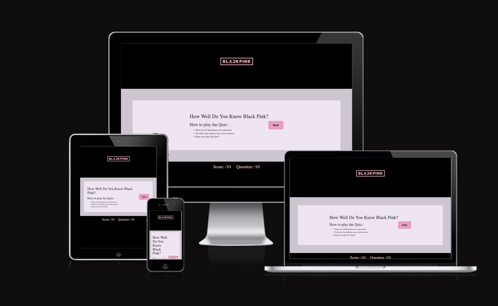
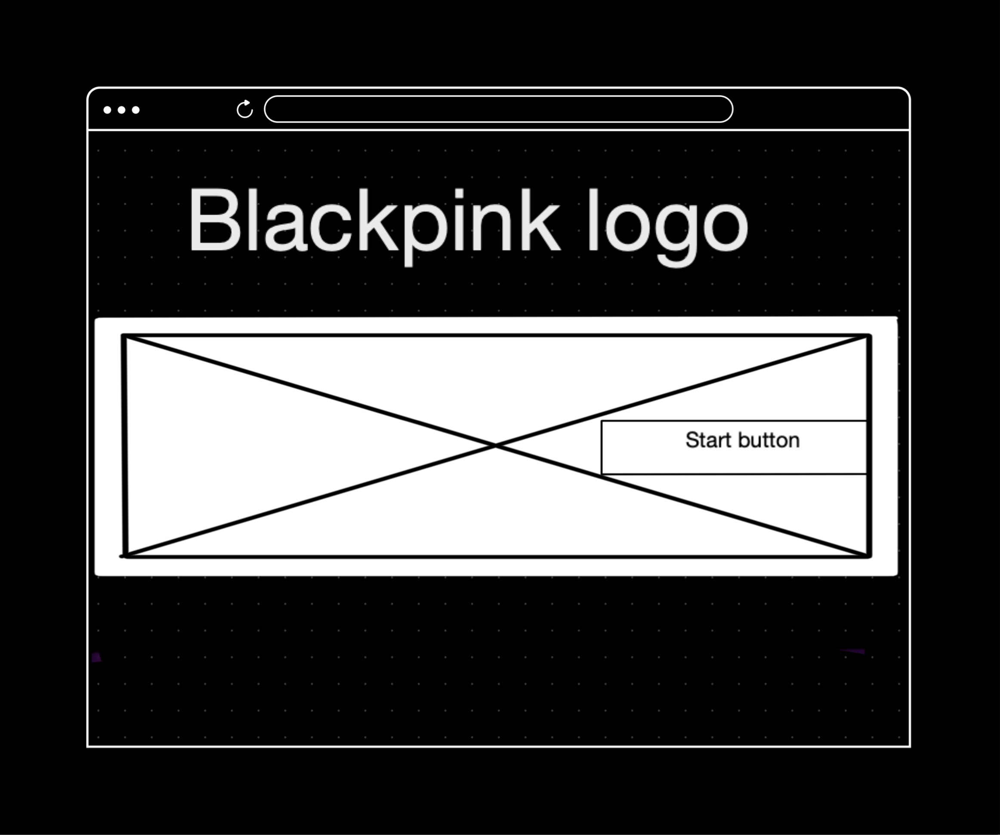
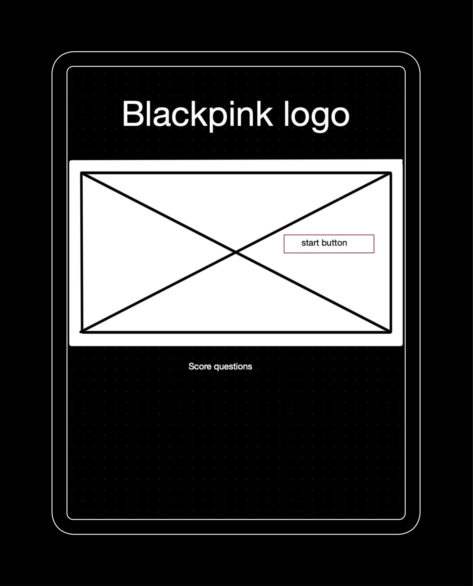
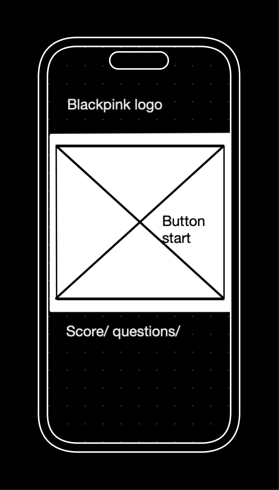
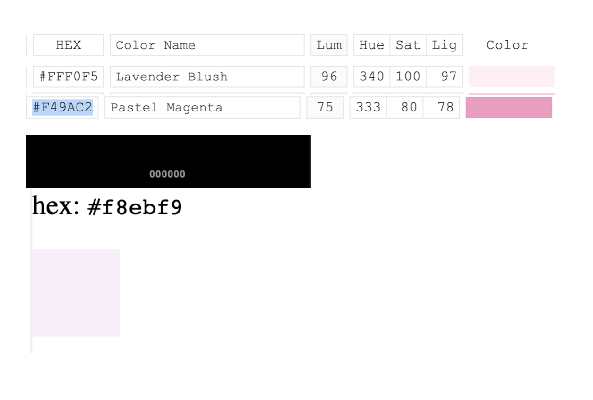
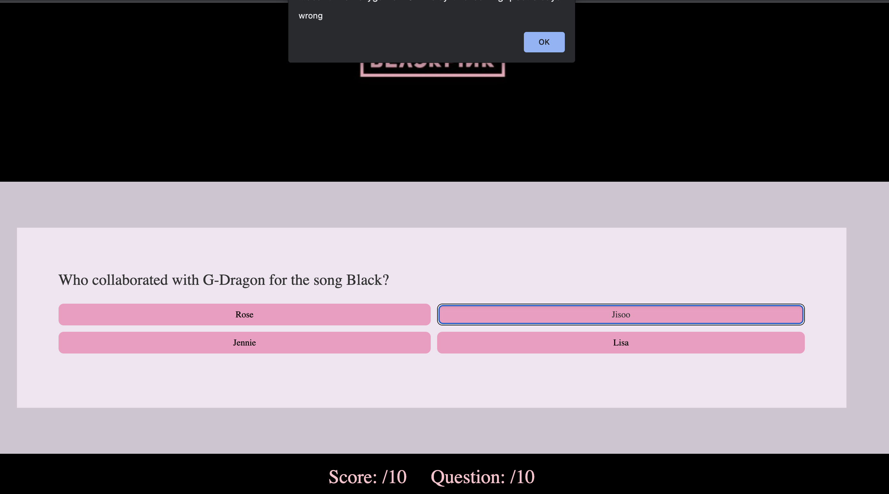
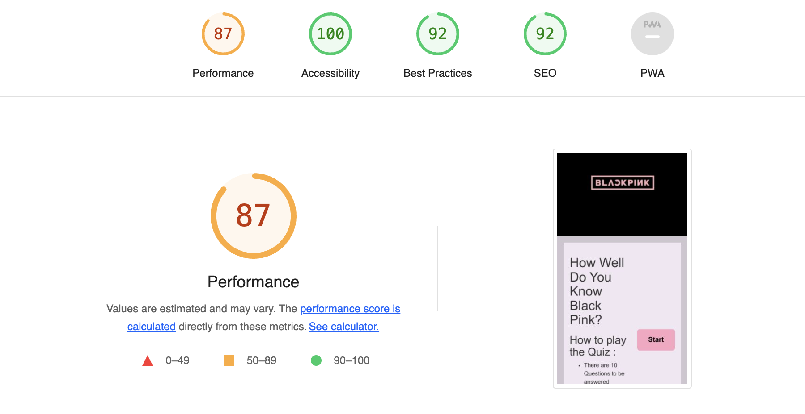
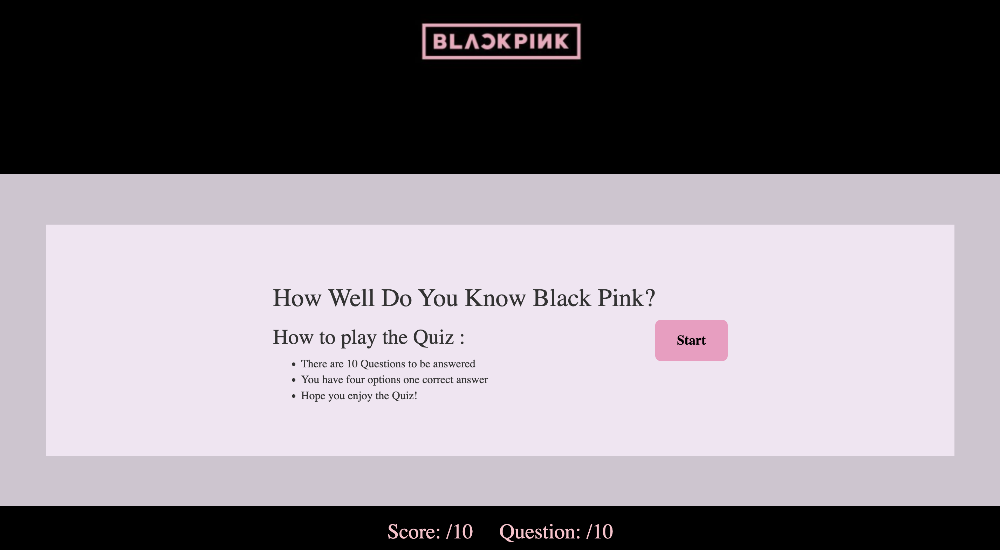
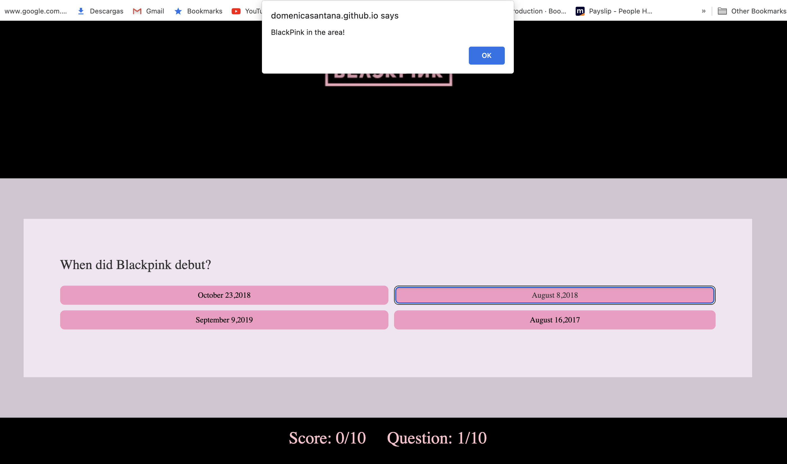

# Domenica's Portfolio 2 website

## User-Centric Frontend Development Milestone Project.

Website presents Domenica's portfolio-2 project called Blackpink Pop Quiz .
Users will be able to find interesting content in easy and simple way.

This project is for educational purposes and can not be used as a template for a business use.
Main aim is to build responsive website with HTML ,JAVASCRIPT and CSS only. I have used Bootstrap framework to keep website consistent and clear.

## [View life website in github pages](https://domenicasantana.github.io/blackpink-pop-quiz/)
---

# Table of contents

- [UX](#ux)
    - [Website owner business goals](#website-owner-business-goals)
    - [User goals](#user-goals)
        - [New user goals](#new-user-goals)
        - [Returning user goals](#returning-user-goals)
        - [Website owner business goals](#website-owner-business-goals)
    - [User stories](#user-stories)
    - [Structure of the website](#structure-of-the-website)
    - [Wireframes](#wireframes)
    - [Surface](#surface)
- [Features](#features)
- [Technology](#technology)
- [Testing](#testing)
    - [Functionality testing](#functionality-testing)
    - [Compatibility testing](#compatibility-testing)
    - [Code Validation](#code-validation)
    - [User stories testing](#user-stories-testing)
    - [Issues found during site development](#issues-found-during-site-development)
    - [Performance testing](#performance-testing)
- [Deployment](#deployment)
- [Credits](#credits)
- [Screenshots](#screenshots)

# UX

## Website owner motivation goals for project 

The main purpose of this website is for  all Blackpink fans known as Blinks,and the new fans to 
have a fun time playing this pop quiz that cointains interesting data from Blackpink.

## User goals

### New user goals:
- user can easily see that this is K-pop Girk Group pop quiz.
- user is able to find the instrunctions on the landing page.
- user can easily locate the start button and the counter at the bottom.

### Expectations from user goals:
- user can learn more about Blackpink new records and new updated information when they come back to the website.
- users to be able to play the game and expect website to match Blackpink insignia colors nicely.

## User stories
* As user I want you to land on main page and be able to tell what is the game about.
* As user I want you to easily navigate through the website.
* As user I want you to press Play and play the game.
* As user I want you to see Rules before the game starts.
* As user I want you to be able to tell how good you have done with questions by tracking the Score.
* As user I want you to be able to press one of the buttons  and see the color of it, if theAnswer is Correct or Incorrect.

### As a new customer:
* I wish to find information about this girl group in an easy and fun way.
* I would like to know my score throughout the game. 
 
## Structure of the website

The website is designed to be easy and user-friendy on all type of devices. On desktop, tablet or mobile device there should be no difference for a user to have a fantastic experience. All parts are designed to achieve maximum user satisfaction including the color palette that has been used. User will get some interaction from the interface .

## Wireframes

I used the Mockup app to create the wireframes for desktop, tablet and mobile view.

## Desktop View Home

## Tablet View Home

 

## Mobile View Home

 

## Surface

### Colors
 

Main colours used in a project:
* background color: #00000
* button color : HEX #F49AC2

### Fonts 

* As a main font I used Sans Roboto , and as a backup Kanit, sans-serif and more. 

### Images

* I used images from [SeekLogo](seeklogo.com) and there are credited in [credits](#credits) section.

[Back to Table of contents](#table-of-contents)
___
# Features

* The website consists of one page.
* Responsive in all devices that players want to use.
* Interactive buttons.
* counter for questions and correct answers.
* User will have a message if the answer is correct: Blackpink in the area !, which is a famous sentence in the fandom of 
  Blackpink in their albums and concerts ,so it is a nice surprise for the fans to read that.

The website has the folowing features:

## Home
* Users can see the rules and the button start from the beginning and after each question they can see features like the button next and also the score for correct answers plus how many questions they have done. 

##  Future implementations

* Add new score table and a user bakcup to compare your score with other people .
* A blog section in a new page so friends and others people can leave comments and interact between them .
* link an Spotify API to hear Blackpinks music while customers play the game.

[Back to Table of contents](#table-of-contents)
___
# Technologies used

### HTML5
* As a structure language.

### CSS
* As a style language.

### Javascript
* As a programing language.

### Bootstrap 
* Bootstrap as a CSS framework to keep responsive, mobile first aproach.

### GitHub
* As a software hosting platform to keep project in a remote location.

### Git
* As a version-control system tracking.

### Gitpod
* As a development hosting platform.

### Mockup App
* As a wireframing tool.

[Back to Table of contents](#table-of-contents)

___
# Testing

## Automated Testing and Manual Testing

### Automated Testing

Automated testing is a type of testing that uses software tools to execute tests. It involves the use of specialized software to write and run test scripts that can quickly and efficiently test software applications. Here are the principles of automated testing:

* Repeatability: Automated tests are repeatable, meaning they can be run repeatedly with the same results.

* Consistency: Automated tests are consistent in the way they run and the results they produce.

* Efficiency: Automated tests can execute quickly and efficiently, which allows for faster testing and quicker feedback.

* Accuracy: Automated tests are more accurate than manual testing, as they reduce the chances of human error.

* Scalability: Automated tests can be scaled up to run thousands of tests in parallel, making it possible to test large and complex applications.

### Manual Testing

Manual testing is a type of testing that involves human testers manually executing test cases and exploring the software application to identify defects. It is a time-consuming and error-prone process, but it can be very effective in identifying defects that may be missed by automated testing. Here are the principles of manual testing:

* Exploratory: Manual testing involves exploring the software application to identify defects that may not be captured by test cases.

* Creativity: Manual testing requires creativity and critical thinking to identify defects that may not be obvious.

* Flexibility: Manual testing allows testers to adjust their testing approach based on the results they find.

* Adaptability: Manual testing allows testers to adapt to changes in the software application or testing environment.

* User perspective: Manual testing can provide a user perspective on the software application.

## Functionality testing 

 I used Chrome developer tools throughout the project for testing and solving problems with responsiveness and for style issues.

## Compatibility testing
 Site was tested across multiple virtual mobile devices and browsers. I checked all supported devices in Chrome developer tools. 
 
 I tested on hardware devices such as: Ipad air with iOS, Iphone SE mini with iOS , Macbook air with MacOS

## User stories testing

### As a User :

- As user I want you to land on main website page and be able to tell what is the game about.
    >Expected results is user looking at the logo and identifying the main theme of the website and see the rules of the game straightaway.

- As user I want the user to easily navigate through the website.
    > The expected results is user looking at the buttons in game and be able to press them and pass to the next question.

- I want my customers to be able to identify the correct and wrong answers.
    > User can see whith the colors red and green which answers is correct and the score is reflected.

## Issues found during site development

* #### Button not showing right or wrong color. 

When the user selected the answer the wrong or right color styling rule wasnt been applied to the relevant buttons.
> I fixed it by ussing bootstrap custom style classes instead of writing my own style .

* #### The counter was not been reset at the end of the game.

When counter for questions and score in the footer was not working.
> I fixed this by reseting the counter variable every time that the reset button was pressed.

## Performance testing

I run [Lighthouse](https://chrome.google.com/webstore/detail/lighthouse/blipmdconlkpinefehnmjammfjpmpbjk?hl=es) tool to check performance of the website.

Final results:

## Code Validation
 At the and of the project I used two websites to validate my code
 
 * [W3C CSS Validator](https://jigsaw.w3.org/css-validator/) to validate CSS

 * [Nu Html Checker](https://validator.w3.org/) to test HTML

 * [Jshint Checker](https://jshint.com/) to test Javascript

[Back to Table of contents](#table-of-contents)

___
# Deployment

The project was deployed on GitHub Pages. I used Gitpod as a development environment where I commited all changes to git version control system.
I used push command in Gitpod to save changes into GitHub.

To deploy a project I had to:

* Log in to GitHub and click on repository to deploy ([blackpink-pop-quiz](https://domenicasantana.github.io/blackpink-pop-quiz/))
* select `Settings` and find GitHub Pages section at the very bottom of the page
* from source select `root` and then `main` branch.
* click `save` and page was deployed after auto-refresh.
>  Your site is published at https://domenicasantana.github.io/blackpink-pop-quiz/

To run localy:
* Log in to GitHub and click on repository to download ([blackpink-pop-quiz](https://github.com/domenicasantana/blackpink-pop-quiz))
* select `Code` and click Download the ZIP file.
* after download you can extract the file and use it in your local environment 

Alternatively you can [Clone](https://docs.github.com/en/free-pro-team@latest/github/creating-cloning-and-archiving-repositories/cloning-a-repository)
or [Fork](https://docs.github.com/en/free-pro-team@latest/github/getting-started-with-github/fork-a-repo)
this repository ([blackpink-pop-quiz](https://github.com/domenicasantana/blackpink-pop-quiz)) into your github account.

[Back to Table of contents](#table-of-contents)
___
# Credits

* To complete this project I used Code Institute student template: [gitpod full template](https://github.com/Code-Institute-Org/gitpod-full-template)

* Ideas and knowledge library:

    * [w3schools.com](https://www.w3schools.com)

    * [css-tricks.com](https://css-tricks.com/)

     * [youtube.com](https://www.youtube.com) I used different videos of creators that gave multiple ideas for javascript codes .

     * [zoompi.com](https://www.soompi.com/article/1538344wpp/quiz-direct-a-blackpink-mv-and-well-guess-your-bias) I used this website and article for questions ideas for the game. 

    * [stackoverflow.com](https://stackoverflow.com/) I used stack overflow constantly whenever I was unsure about HTML or CSS syntax or wanted to find an easier more stream-lined way of doing things.

    * [bootstrap.com](https://www.bootsrap.com) I used this website to understand how to use different styles in my website.  

### Images:

#### seeklogo.com:
* [images/pink-logo.png](https://seeklogo.com/vector-logo/306510/blackpink) image by Designer:Jiatjun.

[Back to Table of contents](#table-of-contents)
___

## Project screenshots

### Home Page

[Back to Table of contents](#table-of-contents)
___